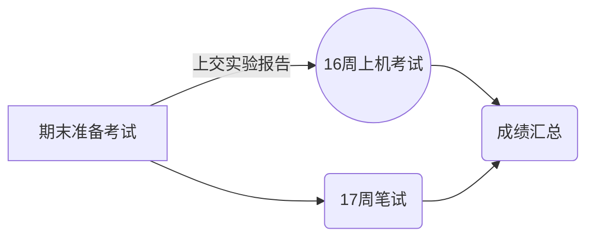

# 2-本科网工成绩历史记录
本学期没有采用app实时展示成绩记录，现在直接在github上展示。每个同学可以看到自己成绩变化的情况。

- 公开，公开是最好的*主
- 公正
- 信息及时传递

## 课代表平时分可以加10分。

```mermaid
graph LR
A[期末准备考试] -- 上交实验报告 --> B((16周上机考试))
A --> C(17周笔试)
B --> D(成绩汇总)
C --> D
```
