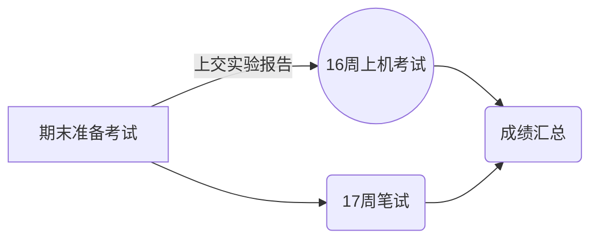

# 25-本科网工成绩历史记录
本学期没有采用app实时展示成绩记录，现在直接在github上展示。每个同学可以看到自己成绩变化的情况。

- 公开，公开是最好的*主
- 公正
- 信息及时传递

## 课代表平时分可以加10分。

flowchart TD
A[学科成绩]

subgraph B[平时表现]
    direction LR
    B1[考勤-课堂表现]
end

subgraph C[考试表现]
    direction LR
    C1[期末考试]
end
subgraph D[其它加分项]
    direction LR
    D1[实验报告]
    D2[特别作业]
end

A --> B
A --> C
A --> D
